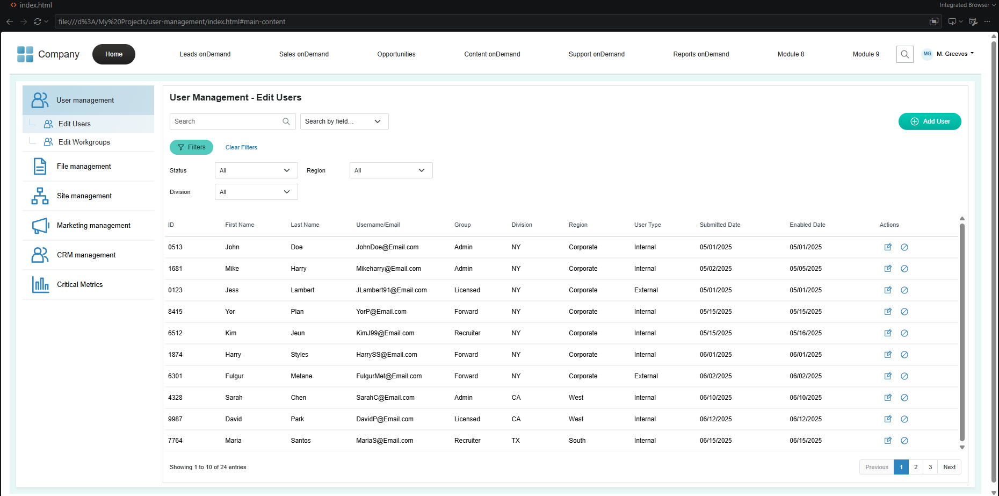
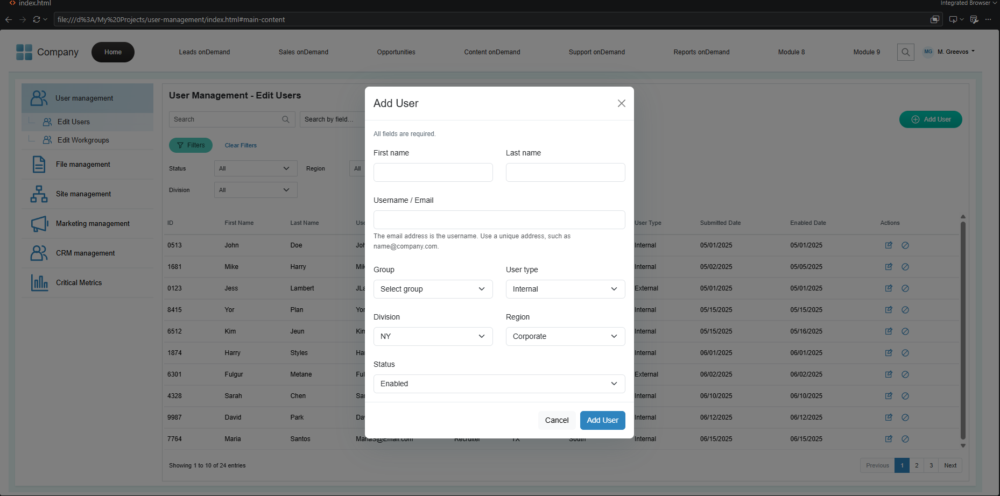

# User Management – Edit Users

## Overview

A responsive recreation of the supplied company user-management screen. The layout retains the horizontal navigation, blue management sidebar, mint workspace frame, compact filters, and user table. All user-management interactions run in the browser.

## Screenshots

User-provided screenshots of the running desktop project. These are captured output, not a guarantee of identical spacing at every viewport or after later refinements.

### Edit Users



### Add User



## Features

- 24 realistic mock users across three initial pages, with 10 users per page.
- Case-insensitive search across relevant fields or a selected field.
- Combined status, division, and region filters. Clear Filters resets search and all filters.
- Pagination based on the current result set, with an explicit no-results state.
- One Bootstrap modal for adding and editing users, with inline required-field, name, length, email-format, and case-insensitive unique email validation.
- Enable users immediately; confirm before disabling. Stable IDs target the correct record after filtering or pagination.
- Accessible action labels, keyboard focus restoration, live result counts, and save/status feedback.
- Responsive navigation and management menu, with horizontal scrolling confined to the table.
- Locally bundled Bootstrap: no CDN, installation, or internet connection needed to run.

## Technologies Used

- HTML5
- CSS3
- Bootstrap 5.3.3 (CSS and JavaScript bundle)
- Vanilla JavaScript

## Project Structure

```text
user-management/
├── index.html                  # Small entry point: assets, scripts, app container
├── css/styles.css              # Reference styling and responsive adjustments
├── js/
│   ├── views/
│   │   ├── header.js           # Company navigation and profile
│   │   ├── sidebar.js          # Management menu and mobile toggle
│   │   ├── users.js            # Search, filters, table and pagination
│   │   ├── modals.js           # Add/Edit, disable and module dialogs
│   │   └── icons.js            # Shared SVG symbols
│   ├── render-layout.js        # Assembles views before app initialization
│   ├── mock-users.js            # Starting demo records
│   ├── user-store.js            # Record operations and metadata rules
│   └── app.js                   # UI state, rendering, validation, events
├── docs/HANDOFF.md              # Change guide and backend integration notes
├── tests/user-store.test.cjs    # Dependency-free data regression tests
├── assets/
│   ├── screenshots/            # User-provided output captures
│   ├── favicon.svg
│   └── vendor/                 # Bootstrap assets and MIT license
└── README.md
```

## How to Run

1. Download or clone [the assessment repository](https://github.com/dianaangan/user-management-assessment).
2. Open the downloaded project directory (`user-management-assessment` when cloned).
3. Open `index.html` in a modern browser.

Alternatively, open the directory in VS Code and use Live Server. No package installation or build step is required.

## Implementation Approach

`index.html` loads the styles and deferred scripts into one app container. Each `js/views/` file contains the static markup for one section. `render-layout.js` assembles those sections before `app.js` attaches behavior. JavaScript templates preserve direct-file operation without fetching HTML partials or adding a build system.

The user store owns one private array of records and exposes explicit read/save/status operations. The UI keeps only page and modal state; it reads snapshots and routes mutations through the store. Mock records are separated from application logic. Each record has a stable string ID, identity fields, group, division, region, user type, account status, and date-only values.

Rendering follows **users → search → combined filters → page slice → DOM**. Search and filter changes return to page one; mutations clamp the page to the available range. Event delegation on the table and pagination avoids rebuilding event handlers. User-provided text is inserted with `textContent`, never interpreted as HTML.

Add and Edit share a form and validation path. IDs and submitted dates are generated automatically for new records and preserved on edits. Successful saves reveal the record's page if it matches the current filters; otherwise a message explains that the saved user is hidden. Form focus is restored after dialogs close.

## Assumptions

- The screenshot is an application reference; the large slide heading and surrounding presentation whitespace are not part of the app.
- User types are Internal and External because their values are not defined in the reference.
- Division and region are independently editable and filterable.
- Enabled Date means the most recent activation date. It is cleared on disable and set to the local date on reactivation. Display dates use MM/DD/YYYY.
- Company modules outside Edit Users show a clear demo-scope dialog. The profile dropdown identifies the mock administrator; there is no authentication flow.
- The first 10 records follow the reference, including Mike's May 5 and Kim's May 16 activation dates. Additional mock users make pagination testable. Result counts and the active page reflect actual state rather than the inconsistent sample footer (10 entries with page 2 selected).

## UI/UX Improvements

Disabled rows include a text status, long values expose their full content on hover, duplicate email addresses are rejected, and no-results feedback suggests a next step. Destructive-looking disable actions require confirmation. Search, status, and filters remain intact after edits.

Form controls use a single subtle focus ring, filters have more separation, and table headings use a lighter weight. The Add/Edit dialog is wider with more padding and space between fields. Validation messages first appear only after clicking the form's Add User or Save Changes button (or submitting with Enter), then update while correcting inputs. Simply typing or leaving a field does not show errors before that first attempt. Failed saves show an accessible summary and focus the first invalid field. Opening another form resets validation to this initial state.

The email address also serves as the username. Validation checks syntax and uniqueness within the current mock data; it does not verify mailbox ownership or deliverability. Names accept international letters, spaces, apostrophes, hyphens, and periods, up to 50 characters.

## Responsive Design

Desktop preserves the two-column workspace. Below 1200px the top navigation collapses. Below 992px the management menu collapses above the content. On mobile, search and filter controls stack and pagination sits below the result count. The table retains readable columns in its own horizontally scrollable region.

## Notes

- No backend or database is required.
- Data is stored in memory. Refreshing the browser resets the mock data.
- Bootstrap is distributed under the MIT license, included in `assets/vendor/LICENSE-bootstrap`.

## Developer Handoff

See [the developer handoff guide](docs/HANDOFF.md) for file responsibilities, the record API, existing workflows, common changes, backend integration steps, and a browser acceptance checklist. The project remains a working front-end application with no build step.

## Verification

With Node.js 18 or newer, run the included data tests without installing packages:

```sh
node --test tests/user-store.test.cjs
```

All 11 included tests pass. They cover reference metadata, additions and edits, required inputs, duplicate emails, missing records, status transitions, immutable snapshots, and unique IDs. A 17-check DOM regression run after the view/data split also passed, covering script initialization, search/filter/pagination, submit-triggered validation, Add/Edit, status changes, modal reset, and screenshot links. Re-run the browser checklist in the handoff guide when changing the UI.

The supplied screenshots document desktop output. Visual browser verification across desktop, tablet, and mobile remains pending; the available browser tool blocked local-file previews. Automated data/DOM checks do not establish visual correctness.

## Assessment Submission

Repository: [dianaangan/user-management-assessment](https://github.com/dianaangan/user-management-assessment)

The repository is public so reviewers can access the complete source and README without an invitation. Use the repository URL in the assessment's Repository URL field.
